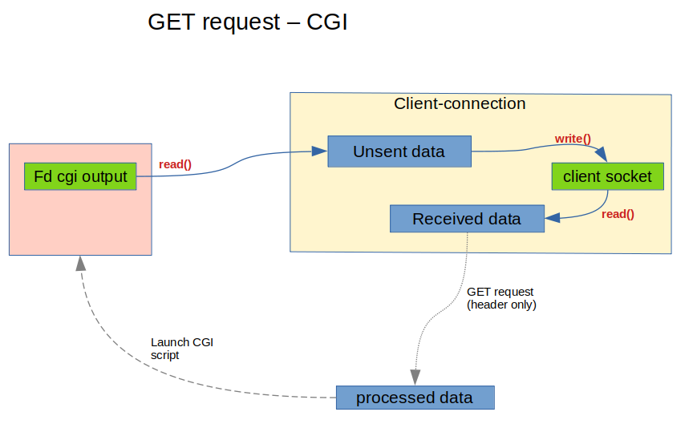
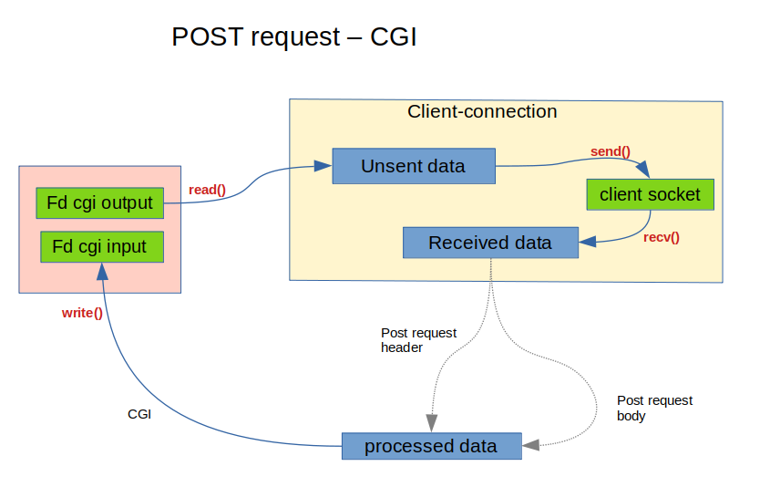

# webserv

What it does at this point:
- serve static files (GET requests)
- echoes back the body of POST requests (working to get CGI working)
- supports multiple ports, (virtual) servers and routes. (configuration is hard coded for testing, no parsing of a config file yet)

Not much error checking/handling. Http response headers very incomplete.

## IO overview

## GET cases

## POST
