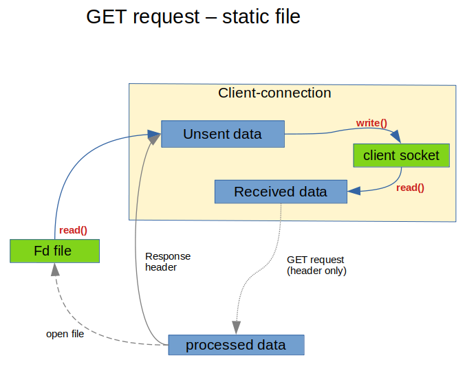
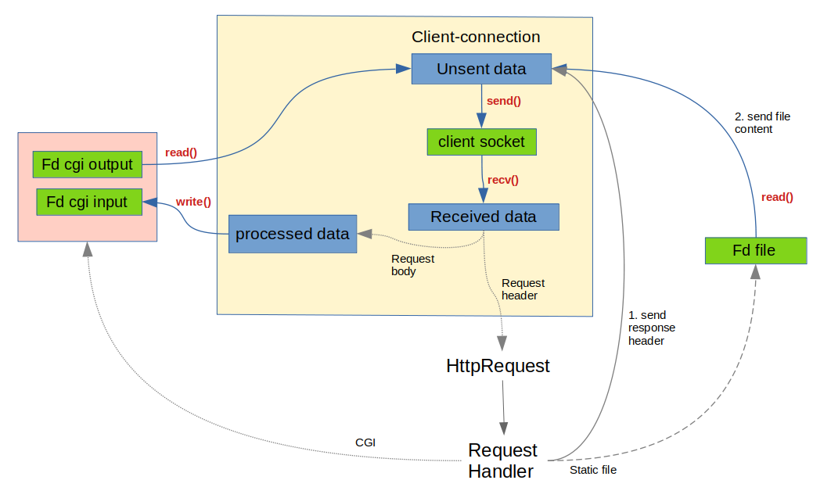

# webserv

What it does at this point:
- serve static files (GET requests)
- supports multiple ports, (virtual) servers and routes. (configuration is hard coded for testing, no parsing of a config file yet)

Not much error checking/handling. Http response headers very incomplete.
 
 
 
### What is does:

### What it shall do:

## Resources 
(credits to David for most of the links below)

Nginx configuration file,
 route (they call it "location") resolution:
[Nginx beginners guide](https://nginx.org/en/docs/beginners_guide.html)

Nginx virtual server resolution:
[How Nginx processes a request](https://nginx.org/en/docs/http/request_processing.html)

Gentle intro to socket programming and HTTP:
[HTTP Server: Everything you need to know to Build a simple HTTP server from scratch](https://medium.com/from-the-scratch/http-server-what-do-you-need-to-know-to-build-a-simple-http-server-from-scratch-d1ef8945e4fa)

A more complete guide to sockets/network programming: 
[Beej's Guide to Network Programming](https://beej.us/guide/bgnet/html/)

HTTP tuto if you're still scared of diving into the RFCs:
[HTTP Made Really Easy](https://www.jmarshall.com/easy/http/)

And CGI! (short read)
[CGI Made Really Easy](https://www.jmarshall.com/easy/cgi/)

Asking ~~Paul~~ poll() which file descriptors are ready for reading/writing:
[IBM - Using poll()](https://www.ibm.com/docs/en/i/7.2?topic=designs-using-poll-instead-select)

The real deal:
[RFC 7230](https://datatracker.ietf.org/doc/html/rfc7230)

## Program design
I suggest you take a look at the contents of the **includes** directory before you read the code starting from main.cpp. Here's a brief description of some classes/structs:

### Client
A **Client** struct represents an accepted connection. It contains a socket and 3 buffers for IO operations: (see includes.hpp):
* received_data: stores data read() from the client socket
* unsent_data: stores data that must be sent to client socket when that socket is ready for a write() operation
* processed_data: not yet in use. Shall be used to store the body of a request after removing chunking meta-data, to be sent to a CGI process.

A Client can be in two different states:
* recv_header: any incoming data will be considered a new Http request
* handling_response: checking for a new request in the received_data buffer will be skipped (data might be part of the body of a request)

### Vserver and Route
The structs **Vserver** and **Route** represent blocks in the configuration file. They are equivalent to nginx's "server" and "location" blocks. See includes.hpp for their definition, and get_test_config (setup.cpp) for an example.

### FdManager
The class **FdManager** ... well, manages file descriptors. And also organizes the array used for calling poll(). So an instance of this class, "table", is seen everywhere in the code. It allows us to know what a given file descriptor refers to (a listening socket, a client socket, a file in disk, the output of a CGI script, etc). And also allow us to define whether a file descriptor will be polled for reading and/or writing operations.

-----------------------------
A quick overview of the loop in main():
### The main loop:
do_io(): does IO operations (no shit!!!!). Calls poll(), loops over the poll array and, depending on the type of file descriptor:
* accepts a new connection (creating a new Client object)
* receives data from a client socket
* sends data to a client socket
* reads data from a file in disk
* etc... (cgi input and output to be included....)

check4new_requests():
* when a Client's received_data buffer contains the header of a new HTTP request, this data is parsed and an instance of a **HttpRequest** object is created.
* After resolving which Vserver and Route applies to this request, the resource path is determined (ex: /web_root/some_file.html), and the apropriate **RequestHandler** is instantiated and added to a list. There are different types of RequestHandlers: one for serving a static file, one for generating an error page, one for generating the directory listing, one for handling a CGI response, etc. Each type is a specific class, but they all inherit from a base class **ARequestHandler** and define their own respond() method.

handle_request():
* iterates over the list of *ARequestHandler (pointers to an abstract class) and calls the respond() method for each one. The respond() method of the specific class is called (yep, subtype polymorphism. plz don't hate me).
* the respond() method of the RequestHandler will perform the sequence of steps in order to send a response to the client (ex: assemble the header of the HTTP reponse, open a file in disk, set it up of reading operation when IO is done, close de fd when done, etc.)
* most often times, a single call of a RequestHandler's repond() method does not complete the response, because it will depend on a IO operation (which can only be done after poll()ing). For this reason, the RequestHandler object keeps track of the **state** of the ongoing response, so it knows what to do when the response() method is called a second (or third, fourth...) time.
* When a reponse is complete, the HttpRequest object and RequestHandler are deleted and removed from the list